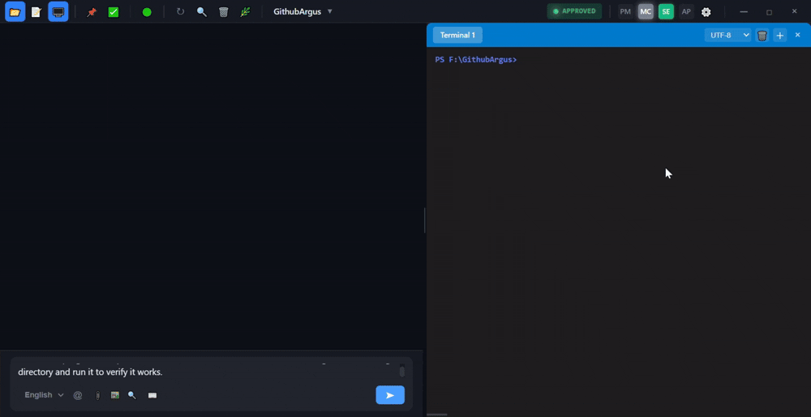

<p align="center">
  
</p>

<p align="center">
  <strong>Argus: The AI coding assistant with PM/SE/AP/C roles – never gets stuck, never forgets.</strong>
</p>

# Argus

**Vibe Coding Platform** — A desktop coding assistant powered by a four-role AI Agent architecture (PM / SE / AP / C) that understands your intent and executes coding tasks autonomously, with a built-in independent approver to ensure code quality.

<p align="center">
  
  
  
  
  
  
</p>

---

## ✨ Why Choose Argus?

### 🎯 Core Advantage: Four-Role AI Collaboration Architecture

Argus employs a **PM (Project Manager) + SE (Software Engineer) + AP (Approver) + C (Monitor)** four-role design that simulates real-world software team workflows:

```
┌─────────────────────────────────────────────┐
│                    👤 User                   │
│              (You - Provide Requirements)    │
└──────────────┬──────────────────────────────┘
               │ Natural Language Input
               ▼
┌─────────────────────────────────────────────┐
│                    🎯 PM                     │
│         (AI Project Manager)                │
│  • Understands your requirements            │
│  • Breaks down tasks & delegates to SE       │
│  • Reviews SE output (Code Review + tools)  │
│  • Communicates progress with you            │
└──────────────┬──────────────────────────────┘
               │ Task Assignment + Quality Control
               ▼
┌─────────────────────────────────────────────┐
│                    💻 SE                     │
│        (AI Software Engineer)               │
│  • Generates code                           │
│  • Writes/edits files                       │
│  • Executes commands                        │
│  • Self-testing verification                │
└──────────────┬──────────────────────────────┘
               │ Task Complete → PM Review Passed
               ▼
┌─────────────────────────────────────────────┐
│                    🔍 AP                     │
│         (AI Approver)                       │
│  • Independent Code Review (uninfluenced)   │
│  • QA Verification (runs compile/test)      │
│  • Veto Power (AP says no → task not done)  │
│  • Up to 3 rounds of tool calls             │
└─────────────────────────────────────────────┘
               ▲
┌──────────────┴──────────────────────────────┐
│                    📊 C                      │
│           (Background Monitor)              │
│  • Monitors PM/SE health status             │
│  • Detects Git changes + auto-commit        │
│  • Identifies stalls and alerts             │
│  • PM→AP handover timeout fallback          │
│  • Read-only — never acts autonomously      │
└─────────────────────────────────────────────┘
```

| Role | Prefix | Intelligence | Responsibility |
|------|--------|-------------|----------------|
| **👤 USR** | `USR` | Human | Provides requirements, makes decisions |
| **🎯 PM** | `PM` | AI (LLM) | Task planning, routing, quality control |
| **💻 SE** | `SE` | AI (LLM) | Code generation, file operations, command execution |
| **🔍 AP** | `AP` | AI (LLM) | Independent approval, QA verification, veto power |
| **📊 C** | `Sys_C` | Mechanical | Health monitoring, change detection, handover fallback |

---

## 🔥 Core Features

### ✅ Implemented Capabilities

#### 1️⃣ Four-Role AI Collaboration (Unique)
- **Natural language interaction**: Chat with PM in Chinese/English; PM automatically breaks down tasks for SE
- **@mention routing**: Use `@PM`, `@SE`, `@AP` to direct messages to specific agents
- **Triple quality assurance**:
  - PM Code Review (mandatory review of SE output, verified with tools)
  - AP Independent Approval (uninfluenced by PM, personally runs compile/test)
  - SE Self-test Verification (must pass before submission)
- **AP Veto Power**: If AP rejects, the task cannot be closed — SE must rework

#### 2️⃣ SSE Streaming Output
- **Real-time visibility into AI thinking process**: Token-by-token display
- **Event-driven push**: pm_started → se_started → writing_file → executing → done
- **Heartbeat keep-alive mechanism**: Automatic disconnect recovery

#### 3️⃣ Complete Task Lifecycle Management
- **Four-state state machine**: idle → running → done → approved
- **Anti-infinite-loop mechanism**: PM review max 10 rounds, SE execution threshold
- **Crash recovery system**: SQLite persistence + task memory recovery

#### 4️⃣ Robust Stability Assurance
- **Rate limiting & circuit breaker protection**: Prevents API overload and cascading failures
- **C monitoring system**: 30s health checks, Git change detection, progressive timeouts, handover fallback
- **Path security sandbox**: File operations restricted to working directory

#### 5️⃣ Rich Integration Capabilities
- **Multi-model support**: OpenAI-compatible API (Qwen, DeepSeek, GLM, GPT, Claude, etc.)
- **Multi-config management**: Switch API providers anytime
- **IM multi-channel integration**: DingTalk (bidirectional, Stream mode), Enterprise WeChat/Feishu (interface reserved)
- **Git integration**: View changes, manual commits, SE output verification

#### 6️⃣ User Experience
- **Modern GUI**: Wails desktop app (no CLI/TUI)
- **Role-differentiated display**: Color-coded messages (USR/PM/SE/Sys_C/Sys_SE)
- **Monaco editor**: VS Code's editor with syntax highlighting
- **Embedded terminal**: xterm.js terminal
- **File tree browser**: Sidebar project navigation
- **Draggable windows**: Freely arrange panels
- **Internationalization**: Chinese/English interface
- **Multi-level notifications**: Silent / Popup / Emergency (IM push)
- **Dark theme**

#### 7️⃣ Security & Permission Control
- **Three-tier decision authority**: Auto / Ask / Block
- **IM switch guard**: No accidental messages
- **Message deduplication**: Frontend + backend filtering
- **Auto-backup**: Before file modification, backup to `.argus/backups/`
- **Global panic recovery**: Goroutine panic protection

---

## 🚀 Quick Start

### Download Pre-built Binary (Recommended)

For the quickest experience, download the latest `argus-desktop.exe` from the [Releases](https://github.com/ArgusTek/argus/releases) page. No build required — just run the exe.

### Build from Source

#### Prerequisites

- **Go** 1.22+
- **Node.js** 18+
- **Wails CLI**: `go install github.com/wailsapp/wails/v2/cmd/wails@latest`
- **OS**: Windows (primary; macOS/Linux builds may work but are untested)

```bash
go version        # go1.22.0+
node --version    # v18.0.0+
wails doctor      # should pass all checks
```

#### One-Click Build (Windows)

```batch
build.bat
```

#### Manual Build Steps

```bash
# Clone
git clone https://github.com/ArgusTek/argus.git
cd argus

# Install frontend deps
cd frontend && npm install && cd ..

# Configure AI API (see Configuration section)

# Build frontend
cd frontend && npm run build && cd ..

# Build Go app
wails build

# Run
./build/bin/argus-desktop.exe
```

> ⚠️ After modifying frontend code, you must run `npm run build` first, then `wails build`.

---

## ⚙️ Configuration

### AI Model Configuration

Configure in the app Settings panel, or copy and edit the template:

```bash
cp config/config.example.json config/config.json
```

```json
{
  "apiConfigs": [
    {
      "id": "1",
      "name": "Qwen Turbo",
      "provider": "qwen",
      "baseUrl": "https://dashscope.aliyuncs.com/compatible-mode/v1",
      "apiKey": "sk-your-api-key-here",
      "modelName": "qwen-turbo",
      "isDefault": true
    }
  ]
}
```

See `config/config.example.json` for the full configuration template.

### IM Integration Configuration

Settings → IM Integration, or copy and edit:

```bash
cp config/dingtalk.example.json config/dingtalk.json
```

```json
{
  "enabled": true,
  "clientId": "your-dingtalk-app-client-id",
  "clientSecret": "your-dingtalk-app-client-secret"
}
```

See `config/dingtalk.example.json` for the full template.

---

## 📖 Usage Guide

### Basic Chat

| Input Example | Effect |
|---------------|--------|
| `Help me write a Hello World` | Send to PM (default), PM analyzes then assigns to SE for execution |
| `@PM analyze this project's architecture` | Explicitly send to PM |
| `@SE fix the bug at line 20 in main.go` | Directly ask SE to execute fix task |
| `@AP review the current changes` | Request AP to perform independent review |

### Keyboard Shortcuts

| Shortcut | Action |
|----------|--------|
| `Ctrl+Enter` | Send message |
| `Ctrl+L` | Clear chat history |
| `Ctrl+S` | Save current file |
| `Esc` | Stop current task |

### Typical Workflow

```
👤 User: Create a Go REST API
   ↓
🎯 PM: I'll break this down:
     1. Create main.go with HTTP server framework
     2. Add /health endpoint
     3. Add /api/users endpoint
     @SE please start with task 1
   ↓
💻 SE: [Creates main.go, writes HTTP server code]
     @PM Task 1 complete, file created
   ↓
🎯 PM: [Reviews main.go using read_file/exec tools] ✓ Passed
     @SE please continue with task 2
   ↓
💻 SE: [Adds /health endpoint]
     @PM Task 2 complete
   ↓
🎯 PM: [Reviews again] ✓ All passed
     @AP Task verified, please perform final quality approval
   ↓
🔍 AP: [Independent Code Review + runs compile/test]
     ✅ Project approved
   ↓
👤 User: Received completion notification! REST API is ready
```

---

<details>
<summary><b>📁 Project Structure (click to expand)</b></summary>

```
argus/
├── main.go                  # Wails application entry point
├── app.go                   # Core business logic & API bindings
├── terminal.go              # Terminal management
├── http_server.go           # HTTP API server
├── wails.json               # Wails configuration
├── build.bat                # One-click build script
├── go.mod / go.sum          # Go dependencies
│
├── cmd/                     # CLI tools (testing/debugging)
│   ├── argus/               # Main launcher
│   ├── pm/                  # Standalone PM test
│   ├── se/                  # Standalone SE test
│   └── test/                # Integration tests
│
├── config/                  # Configuration files
│   ├── config.example.json  # API configuration template
│   └── dingtalk.example.json # DingTalk configuration template
│
├── internal/
│   ├── ai/                  # AI client & prompts
│   │   ├── client.go        # OpenAI-compatible API client
│   │   ├── pm_prompt.go     # PM system prompt & processor
│   │   ├── se_prompt.go     # SE system prompt & processor
│   │   ├── se_prompt_test.go # SE prompt tests
│   │   └── ap_prompt.go     # AP approval prompt & processor
│   ├── chat/                # Chat management
│   │   ├── manager.go       # Unified ChatManager (PM/SE/AP/C orchestration)
│   │   ├── router.go        # @mention message router
│   │   ├── sse_bridge.go    # SSE streaming bridge
│   │   └── sse_bridge_test.go # SSE bridge tests
│   ├── monitor/             # Background monitoring
│   │   └── c_monitor.go     # C monitor (health, git, alerts, handover fallback)
│   ├── memory/              # Memory & context system
│   │   ├── manager.go       # SQLite-backed memory store
│   │   ├── compressor.go    # Context compression
│   │   ├── context.go       # Context builder
│   │   ├── session.go       # Session management
│   │   └── working.go       # Working memory
│   ├── executor/            # Command executor
│   │   └── executor.go      # Secure command execution with sandboxing
│   ├── pm/                  # PM executor
│   │   └── executor.go      # Task management
│   ├── se/                  # SE executor
│   │   └── executor.go      # Code generation & file operations
│   ├── board/               # Task board (Kanban)
│   │   └── board.go         # Board state management
│   ├── dingtalk/            # DingTalk integration
│   │   ├── dingtalk.go      # Bot client
│   │   └── stream.go        # Stream mode handler
│   ├── limiter/             # Rate limiting & safety
│   │   ├── ratelimit.go     # API rate limiter
│   │   ├── circuit_breaker.go # Circuit breaker
│   │   └── logger.go        # Request logger
│   ├── git/                 # Git operations
│   │   └── git.go           # Git integration (status, diff, commit)
│   ├── i18n/                # Internationalization
│   │   └── i18n.go          # Locale management
│   └── types/               # Shared type definitions
│       └── types.go
│
├── frontend/                # Vue 3 frontend
│   ├── src/
│   │   ├── App.vue          # Root component
│   │   ├── main.ts          # Vue entry point
│   │   ├── style.css        # Global styles
│   │   ├── components/      # UI components
│   │   │   ├── ChatPanel.vue      # Chat interface
│   │   │   ├── EditorArea.vue     # Monaco editor
│   │   │   ├── FileTreeWindow.vue # File browser
│   │   │   ├── TerminalWindow.vue # xterm.js terminal
│   │   │   ├── GitWindow.vue      # Git status panel
│   │   │   ├── SettingsDialog.vue # Settings modal
│   │   │   ├── StatusBar.vue      # Bottom status bar
│   │   │   └── ...                # 22+ components
│   │   └── composables/
│   │       └── useDraggable.ts    # Drag & drop
│   ├── wailsjs/             # Auto-generated Wails bindings
│   ├── package.json
│   └── vite.config.ts
│
└── build/                   # Build output (gitignored)
    └── bin/
        └── argus-desktop.exe
```

</details>

<details>
<summary><b>⚠️ Current Limitations & Recent Fixes (click to expand)</b></summary>

### Platform Support
- **Windows only** (primary platform; macOS/Linux may work but are untested)

### Known Issues & Improvements Needed
- **API timeout resilience**: Under high latency, the AI API may time out (especially NVIDIA API), causing the SE→PM review chain to pause. We are implementing retry with exponential backoff.
- **Test coverage**: Insufficient unit tests; most validation is manual.
- **Large project performance**: >1000 files may slow file tree rendering.
- **AP approval degradation**: Models without tool-calling support fall back to a no-tools approval path.
- **SSE single connection**: Only one HTTP client can subscribe to the event stream at a time.

### ✅ Recent Fixes (v0.1.1)
- **G57**: PM/USR empty message fix — PM now uses single `pm_message` event channel (like AP), eliminating dual-channel conflicts
- **G59**: SE duplicate display fix — Merges `new-message` into existing exec card instead of creating duplicate messages
- **G60**: Frontend-backend consistency audit — Bidirectional audit log system that auto-detects message loss/duplication
- **Message ID tracking (G49)**: Unique message IDs ensure one-to-one correspondence between backend and frontend messages
- **SE status reset on MC retry**: Fixes SE status not being reset when MC auto-retries failed tasks

> We are working hard to resolve these. Your issue reports are highly appreciated!

</details>

---

## 🗺️ Roadmap

### ✅ Version 0.1.0 (Completed)
- [x] PM/SE/AP/C four-role collaboration architecture
- [x] AP independent approval + veto power
- [x] PM→SE→PM Review→AP Approval complete pipeline
- [x] SSE streaming output
- [x] Complete state machine management
- [x] Anti-infinite-loop mechanism
- [x] Crash recovery + task memory
- [x] C monitoring system (including PM→AP handover fallback)
- [x] Rate limiting & circuit breaker protection
- [x] IM multi-channel integration (DingTalk/Enterprise WeChat/Feishu)
- [x] Internationalization support (Chinese/English)
- [x] Message deduplication mechanism
- [x] Global panic recovery protection

### ✅ Version 0.1.1 (Current — May 2026)
- [x] **Message ID tracking system** (G49) — Unique IDs for frontend-backend consistency
- [x] **PM empty message fix** (G57) — Unified PM event channel, no more dual-channel conflicts
- [x] **SE duplicate display fix** (G59) — Single SE message with merged exec card content
- [x] **Frontend-backend audit system** (G60) — Bidirectional consistency verification
- [x] **SE status reset on MC retry** — Fixes stuck SE state after auto-retry
- [x] **JSON content cleanup** (G51) — SE JSON output converted to human-readable text for PM review

### 🔨 Version 0.2.0 (In Development)

- [ ] Local model support (Ollama integration)
- [ ] VS Code plugin version
- [ ] Memory system integration into ChatManager (context-aware conversations)
- [ ] Basic unit test coverage
- [ ] Plugin SDK (v0.1 preview)

### 🎯 Version 0.3.0

- [ ] Full macOS/Linux support
- [ ] Multi-SE parallel execution
- [ ] Enterprise WeChat & Feishu official integration
- [ ] Plugin marketplace open
- [ ] Performance optimization (large project support)

### 🚀 Version 1.0.0

- [ ] Comprehensive test suite (coverage >80%)
- [ ] CI/CD pipeline
- [ ] Complete user documentation & video tutorials
- [ ] Cloud Hosting SaaS version
- [ ] Open Core commercialization exploration

---

## 🤝 Contributing

We welcome all forms of contribution! Whether it's code, documentation, bug reports, or feature suggestions.

### How to Contribute

1. Fork this repository
2. Create a feature branch (`git checkout -b feature/amazing-feature`)
3. Commit your changes (`git commit -m 'Add amazing feature'`)
4. Push to the branch (`git push origin feature/amazing-feature`)
5. Create a Pull Request

### Contribution Guidelines

- Check [Good First Issue](../../issues?q=is%3Aopen+is%3Aissue+label%3A%22good+first+issue%22) for beginner-friendly tasks
- Feel free to open an issue for any bug report or feature request

---

## 📄 License

This project is licensed under the MIT License - see the [LICENSE](./LICENSE) file for details.

---

<p align="center">
  <strong>Built with ❤️ by the Argus maintainer</strong>
</p>
```
